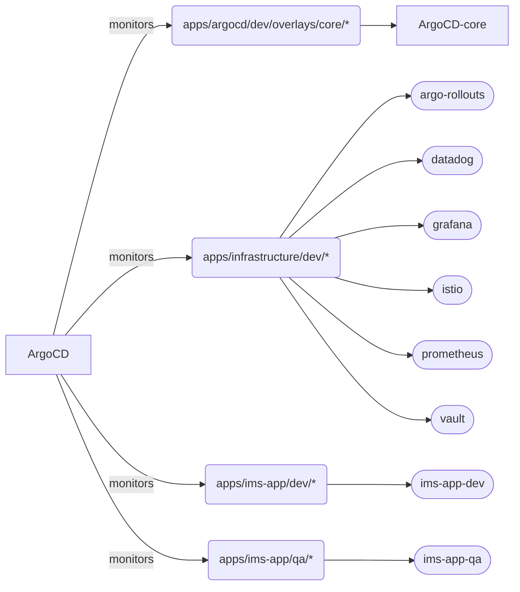

# Documentation Home

## Repository Structure


```
devops
├── README.md
├── apps
│   ├── README.md
│   ├── argocd
│   │   ├── dev
│   │   │   ├── base
│   │   │   │   ├── argocd-rbac-cm.yaml
│   │   │   │   ├── argocd-repo-server.yaml
│   │   │   │   ├── argocd-secret.yaml
│   │   │   │   ├── artifactory.yaml
│   │   │   │   ├── cmp-plugin.yaml
│   │   │   │   ├── kustomization.yaml
│   │   │   │   ├── namespace.yaml
│   │   │   │   ├── plugins
│   │   │   │   │   └── argo-vault-plugin.yaml
│   │   │   │   ├── rbac-secret-access.yaml
│   │   │   │   ├── repository.yaml
│   │   │   │   ├── service-account.yaml
│   │   │   │   └── vault-configuration.yaml
│   │   │   └── overlays
│   │   │       └── core
│   │   │           ├── configmap
│   │   │           │   └── argocd-cm.yaml
│   │   │           ├── environments
│   │   │           │   ├── core.yaml
│   │   │           │   └── dev.yaml
│   │   │           └── kustomization.yaml
│   │   └── prod
│   │       ├── base
│   │       │   ├── argocd-rbac-cm.yaml
│   │       │   ├── argocd-repo-server.yaml
│   │       │   ├── argocd-secret.yaml
│   │       │   ├── artifactory.yaml
│   │       │   ├── avp-argocd-cm.yaml
│   │       │   ├── kustomization.yaml
│   │       │   ├── namespace.yaml
│   │       │   ├── plugins
│   │       │   │   └── argo-vault-plugin.yaml
│   │       │   ├── rbac-secret-access.yaml
│   │       │   ├── repository.yaml
│   │       │   ├── service-account.yaml
│   │       │   └── vault-configuration.yaml
│   │       └── overlays
│   │           └── core
│   │               ├── configmap
│   │               │   └── argocd-cm.yaml
│   │               ├── environments
│   │               │   ├── core.yaml
│   │               │   └── prod.yaml
│   │               └── kustomization.yaml
│   ├── ims-app
│   │   ├── dev
│   │   │   ├── ims-identitystore
│   │   │   │   └── application.yaml
│   │   │   ├── ims-operations
│   │   │   │   └── application.yaml
│   │   │   ├── ims-storeworker
│   │   │   │   └── application.yaml
│   │   │   └── ims-tenant
│   │   │       └── application.yaml
│   │   └── qa
│   │       ├── ims-identitystore
│   │       │   └── application.yaml
│   │       ├── ims-operations
│   │       │   └── application.yaml
│   │       ├── ims-storeworker
│   │       │   └── application.yaml
│   │       └── ims-tenant
│   │           └── application.yaml
│   └── infrastructure
│       ├── dev
│       │   ├── argo-rollouts
│       │   │   └── kustomization.yaml
│       │   ├── bookinfo
│       │   │   ├── bookinfo.yaml
│       │   │   ├── bookinfoDestination.yaml
│       │   │   └── bookinfoVS.yaml
│       │   ├── datadog
│       │   │   └── application.yaml
│       │   ├── grafana
│       │   │   └── grafana.yaml
│       │   ├── istio
│       │   │   ├── README.md
│       │   │   ├── destination.yaml
│       │   │   ├── gateway.yaml
│       │   │   ├── istio-base.yaml
│       │   │   ├── istio-ingress.yaml
│       │   │   ├── istiod.yaml
│       │   │   └── virtualservice.yaml
│       │   ├── prometheus
│       │   │   ├── app
│       │   │   │   ├── prometheus-crd.yaml
│       │   │   │   ├── prometheus-skp-crds.yaml
│       │   │   │   └── prometheus.yaml
│       │   │   └── k8-crd.yaml
│       │   └── vault
│       │       ├── README.md
│       │       └── application.yaml
│       └── prod
│           ├── argo-rollouts
│           │   └── kustomization.yaml
│           ├── grafana
│           │   └── grafana.yaml
│           ├── istio
│           │   ├── destination.yaml
│           │   ├── gateway.yaml
│           │   ├── istio-base.yaml
│           │   ├── istio-ingress.yaml
│           │   ├── istiod.yaml
│           │   └── virtualservice.yaml
│           ├── monitoring
│           │   ├── grafana
│           │   │   └── grafana.yaml
│           │   ├── kustomization.yaml
│           │   └── prometheus
│           │       ├── prometheus-crd.yaml
│           │       ├── prometheus-skp-crds.yaml
│           │       └── prometheus.yaml
│           ├── prometheus
│           │   ├── kustomization.yaml
│           │   ├── prometheus-crd.yaml
│           │   ├── prometheus-skp-crds.yaml
│           │   └── prometheus.yaml
│           └── vault
│               └── application.yaml
├── argocd
│   ├── README.md
│   ├── dev
│   │   └── kustomization.yaml
│   └── prod
│       └── kustomization.yaml
└── environments
    ├── README.md
    ├── dev
    │   ├── config
    │   │   ├── argo-projects
    │   │   │   ├── datadog.yaml
    │   │   │   ├── dev.yaml
    │   │   │   ├── infrastructure.yaml
    │   │   │   └── qa.yaml
    │   │   ├── argo-repos
    │   │   │   ├── community-prometheus.yaml
    │   │   │   ├── datadog-repo.yaml
    │   │   │   └── devops-repo.yaml
    │   │   ├── kustomization.yaml
    │   │   ├── namespaces
    │   │   │   ├── datadog.yaml
    │   │   │   ├── dev.yaml
    │   │   │   ├── monitoring.yaml
    │   │   │   ├── prod.yaml
    │   │   │   ├── qa.yaml
    │   │   │   ├── services.yaml
    │   │   │   ├── test.yaml
    │   │   │   └── vault.yaml
    │   │   └── secrets
    │   │       ├── artifactory.dev.yaml
    │   │       ├── artifactory.qa.yaml
    │   │       └── example-secret.yaml
    │   └── core
    │       ├── applicationsets
    │       │   ├── argo.yaml
    │       │   ├── ims-app-dev.yaml
    │       │   ├── ims-app-qa.yaml
    │       │   ├── infrastructure.yaml
    │       │   └── monitoring.yaml
    │       ├── cluster-secrets
    │       │   └── example-vault.secret.yaml
    │       └── kustomization.yaml
    └── prod
        ├── config
        │   ├── argo-projects
        │   │   ├── datadog.yaml
        │   │   ├── infrastructure.yaml
        │   │   └── prod.yaml
        │   ├── argo-repos
        │   │   ├── community-prometheus.yaml
        │   │   ├── datadog-repo.yaml
        │   │   └── devops-repo.yaml
        │   ├── kustomization.yaml
        │   ├── namespaces
        │   │   ├── datadog.yaml
        │   │   ├── monitoring.yaml
        │   │   ├── prod.yaml
        │   │   └── vault.yaml
        │   └── secrets
        │       ├── artifactory.prod.yaml
        │       └── example-secret.yaml
        └── core
            ├── applicationsets
            │   ├── argo.yaml
            │   ├── ims-app.yaml
            │   ├── infrastructure.yaml
            │   └── monitoring.yaml
            ├── cluster-secrets
            │   └── example-vault.secret.yaml
            └── kustomization.yaml
```
